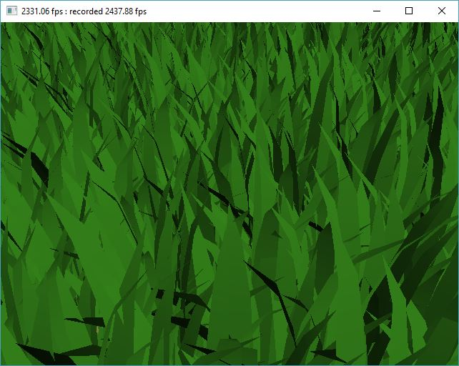
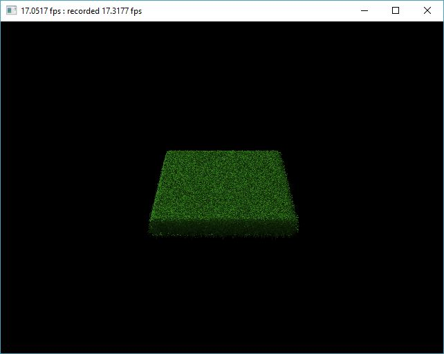
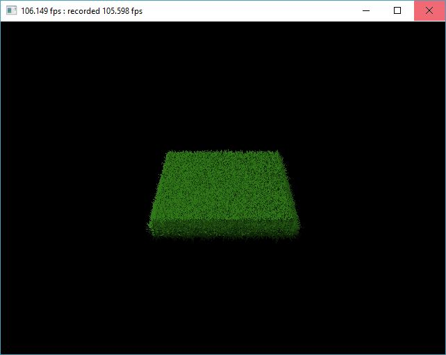

Vulkan Grass Renderer
========================

* Tested on: Windows 10, i7-7700K @ 4.20GHz 16.0GB, GTX 1080 15.96GB

Overview 
======================

Analysis 
======================
* Compute shader WORKGROUP_SIZE is set to (32, 0, 0).

* Rendering time is measured in fps, so higher is better.

* Maximum distance for distance culling is 50.

* Frustum culling tolerance is 0.9.

* Orientation culling threshold is 0.2.

* This project is based on the paper [Responsive Real-Time Grass Rendering for General 3D Scenes
](https://www.cg.tuwien.ac.at/research/publications/2017/JAHRMANN-2017-RRTG/JAHRMANN-2017-RRTG-draft.pdf).

---

## I. Grass Generation

### overview

### detail

Every grass blade is generated based on 3 vertices, v0, v1 and v2. v0 is the root location. v2 is the tip of the grass. The 3 vertices are the control points of a 2nd degree Bezier curve. To generate the shape of the grass blade, tessellation shaders are used. For every 3 control points, a quad patch is generated with fixed inner and outter tessellation level. Based on the unique tessellation uv coordinates, the generated vertice are warpped along the Bezier curve represented by v0, v1 and v2 both vertically and horizontally. To apply physics, the position of v2 is transformed based on the gravity effect downwards and its effect in the front direction. To ensure v1 is always appropriate, its location is calculated based on the position of v2 and the projection of v2 - v0 on to the grass plane. To ensure the length of the grass blade stays the same and the blade always stay above ground, two validation methods are used. You can find them at chapter 5.2 in the paper [Responsive Real-Time Grass Rendering for General 3D Scenes
](https://www.cg.tuwien.ac.at/research/publications/2017/JAHRMANN-2017-RRTG/JAHRMANN-2017-RRTG-draft.pdf).

## II. Orientation Culling

### overview

### detail

When looking from left or right side of the grass blade, the blade will take less screen pixels almost like a line segment. It is better not to show it because it's not going to make too much difference and also because we want to avoid aliasing caused by the "line segment". The eaisist way to do this is to test the angle between the direction from the grass blade to the camera and the front direction of the grass blade. In practice, I use the dot product to achieve this. If the absolute value of the dot product is smaller than the aforementioned threshold 0.2, then the grass blade is culled. Usually this will do in simple cases but when camera goes over the head and facing downwards to the grass plane, all the grass blades will be culled since the front direction of them are all perpendicular to the viewing direction. To solve this problem, one can use the vector projected by the viewing direction on to the grass plane instead.

---

## III. Frustum Culling

### overview

### detail

When looking from very close distance, the grass blades outside the camera frustum will now be rendered. To boost performance, we can cull these grass blades in advance. The way I used is transfering the 3 control points of the bezier curve of each grass blade in to culling space, and perform a general frustum culling by checking x, y, z agianst w component. If they are not within the range [w, -w] (assuming w is negative), they are culled.

---

## IV. Distance Culling

### overview

### detail

When looking from very far distance, the density of the grass doesn't need to be too high because we can hardly tell the difference and also because we want to avoid aliasing caused by a lot of small objects at far distance. The way I do this is to use the distance from the grass blade to the camera as a why to decide what LOD level they should be. Assuming the maximum LOD is n, in LOD m, we want to cull m grass blades out of every n grass blades. This is achieved by take adding the grass index in to the mix. When int(bladeId) % n < int(n * (dproj / dfar)), the grass is culled. dproj is the vector projected by the viewing direction on to the grass plane so that the distance culling is independent to the vertical viewing angle(same reason as orientation culling). dfar is the distance of LOD n. The paper [Responsive Real-Time Grass Rendering for General 3D Scenes
](https://www.cg.tuwien.ac.at/research/publications/2017/JAHRMANN-2017-RRTG/JAHRMANN-2017-RRTG-draft.pdf) used a different formula which I think is a mistake in editing.

---

## Showcase One 8192 (2^13) grass blades

### overview

### analysis

This is the bench mark configuration. From the chart, we can see that orientation culling and distance culling works better when the grass is far away from the camera and frustum culling works better when the grass is near to the camera. For orientation culling, this is because the orientation culling depends on the angle between the side direction of the grass and the direction from camera to the grass blade. So when the camera is far from the grass, this angle is smaller, meaning the side of grass is more aligned with the viewing direction, thus it's more likely to be culled. For distance culling, this is because the maximum number of grass blades that can be culled depends on the distance from the grass blade to the camera. So when the camera is far from the grass, more grass will be catogrized in a higher LOD level, thus more grass blade can be culled. For frustum culling, this is simply because none of the grass are outside the camera frustum with the far and mid configuration. However, one interesting thing is that orientation culling and frustum culling in mid distance is the slowest, where they are supposed to be in the middle. One of the reason that I can think of is the grass occupies more screen pixels because of the viewing distance is nearer, which results in longer rendering time.

### images

|      distance       |            far          |            mid          |           near           |
|:-------------------:|:-----------------------:|:-----------------------:|:------------------------:|
|    culling off      ||||
| orientation culling |   |   |   |
|   frustum culling   |   |   |   |
|   distance culling  |   |   |   |
|   all culling on    | | | |

---

## Showcase Two 131072 (2^17) grass blades

### overview

### analysis

When there are more grass blades, the rendering time is slower. But the pattern remains the same. Orientation culling and distance culling works better when the grass is far away from the camera and frustum culling works better when the grass is near to the camera.

### images

|      distance       |            far          |            mid          |           near           |
|:-------------------:|:-----------------------:|:-----------------------:|:------------------------:|
|    culling off      ||||
| orientation culling |   |   |   |
|   frustum culling   |   |   |   |
|   distance culling  |   |   |   |
|   all culling on    | | | |

---

## Showcase Three 2097152 (2^21) grass blades

### overview

### analysis

When there are much more grass blades, the rendering time is much slower. But the pattern remains the same. Orientation culling and distance culling works better when the grass is far away from the camera and frustum culling works better when the grass is near to the camera. Among all the three culling options, the performance change in distance culling due to distance is the most significent, even though the performance change for the other two culling options is mellowed out because of the large number of grass blades. This is mostly becuase the distance culling algorithm is the most progressive one, meaning the standard is the lest strict which can result in a lot of grass blades getting culled.

### images

|      distance       |            far          |            mid          |           near           |
|:-------------------:|:-----------------------:|:-----------------------:|:------------------------:|
|    culling off      ||||
| orientation culling |   |   |   |
|   frustum culling   |   |   |   |
|   distance culling  |   |   |   |
|   all culling on    | | | |

---
